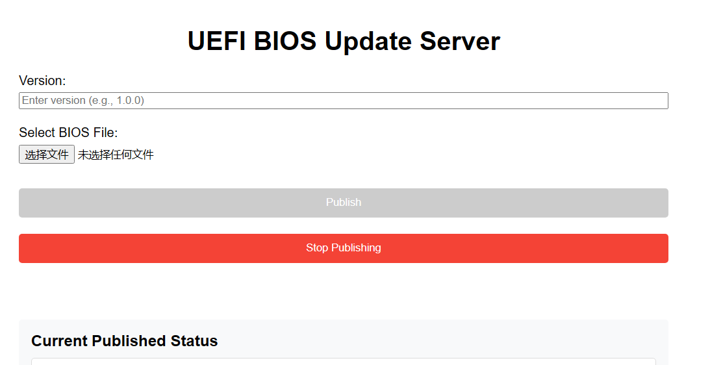
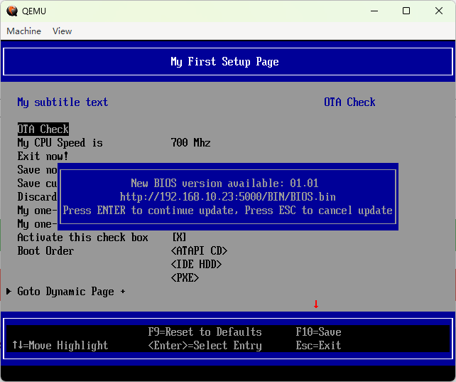
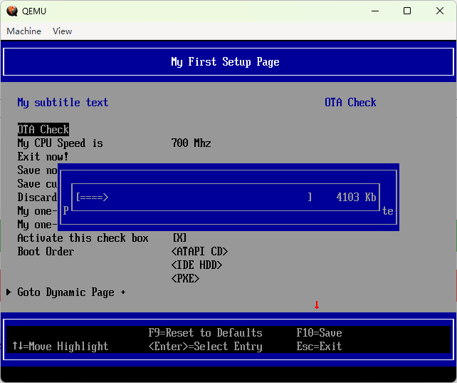

# UefiOta
A minimal implementation of UEFI OTA.

### [UEFIUpdateServer.py](./ServerScript/UEFIUpdateServer.py)
Provides a minimal HTTP server as a UEFI OTA check server.
#### Usage
```
py -3 UEFIUpdateServer.py {port}
```

It will show some tips like:
```
Server started at http://123.456.78.90:5000
Press Ctrl+C to stop the server
```

Open `http://123.456.78.90:5000` link, then input *Version* and *Select BIOS File*, then *Publish*.


`http://123.456.78.90:5000/update` will provide OTA message and binary's link:
```
{"message": "New BIOS version available: 01.01", "image_url": "http://123.456.78.90:5000/BIN/BIOS.bin"}
```

### [HttpDownloadLib](./Library/HttpDownloadLib/HttpDownloadLib.inf)
Based on `EDKII ShellPkg HttpApp`, and modify it to a Library to provide `HttpDownloadFile()` API.

### [TestApp](./Application/TestApp/)
UEFI Shell application to test [UEFIUpdateServer.py](./ServerScript/UEFIUpdateServer.py) and [HttpDownloadLib](./Library/HttpDownloadLib/HttpDownloadLib.inf).

### UEFI BIOS SETUP
Add one button in .VFR like:
```
    text
      help   = STRING_TOKEN(STR_UEFI_OTA),
      text   = STRING_TOKEN(STR_UEFI_OTA),
      flags  = INTERACTIVE,
      key    = 0x1024;
```

Call `BiosUpdateCheckHttp`(TestApp) in HiiConfigAccess.Callback. (You need to add some code to call UEFI BIOS Update function)





### TODO
- [ ] `HttpDownloadLib` download speed
- [ ] HTTPS?
- [ ] JSON Parser?
